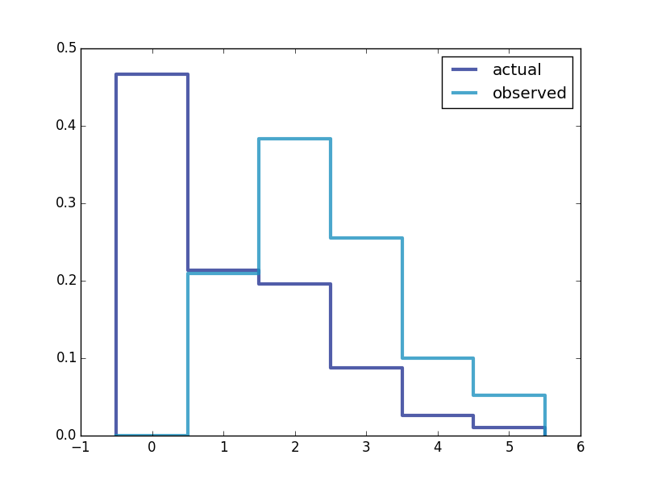

[Think Stats Chapter 3 Exercise 1](http://greenteapress.com/thinkstats2/html/thinkstats2004.html#toc31) (actual vs. biased)

>>``` 
>>
>>def get_data():
>>  data = chap01soln.ReadFemResp()
>>  data = data.numkdhh
>>  return data
>>
>>def BiasPmf(pmf,label):
>>  new_pmf = pmf.Copy(label=label)
>>
>>  for x,p in pmf.Items():
>>    new_pmf.Mult(x,x)
>>
>>  new_pmf.Normalize()
>>  return new_pmf
>>
>>def process(data):
>>  count = thinkstats2.Hist(data)
>>  pmf = thinkstats2.Pmf(count,label='actual')
>>  print("actual mean:"+str(pmf.Mean()))
>>  biased_pmf = BiasPmf(pmf,label='observed')
>>  print("bias mean:"+str(biased_pmf.Mean()))
>>  thinkplot.PrePlot(2)
>>  thinkplot.Pmfs([pmf,biased_pmf])
>>  thinkplot.Show()
>>
>>
>>def main():
>>  data = get_data()
>>  process(data)
>>  
>>
>>if __name__ == '__main__':
>>  main()
>>```
>>
>> this yields
>>actual mean: 1.02420515504
>>bias mean: 2.40367910066
>> 
>> and produces
>>
