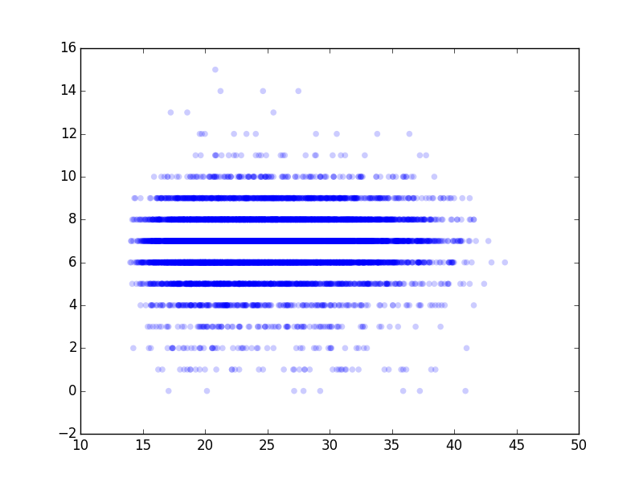
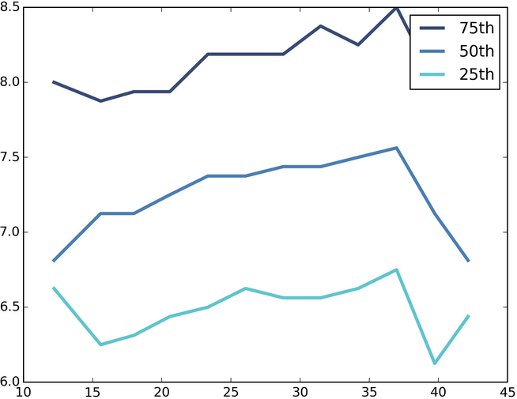

[Think Stats Chapter 7 Exercise 1](http://greenteapress.com/thinkstats2/html/thinkstats2008.html#toc70) (weight vs. age)

>> Scatter plot of birth weiht vs. Mother's Age
>> 
>> and the percentile graph was found by binning the values and cdf
>> 
>> Get Pearson Correlation
>> ```
>> live = data
>> live = live[live.birthwgt_lb>=0]
>> live = live[live.agepreg>=14]
>> age = live.agepreg
>> weights= live.birthwgt_lb
>> thinkstats2.Corr(age,weights)
>> 0.068565696774587848
>> And then Spearman
>> age.corr(weights, method = 'spearman')
>> 0.094357108056248529
>> ```

