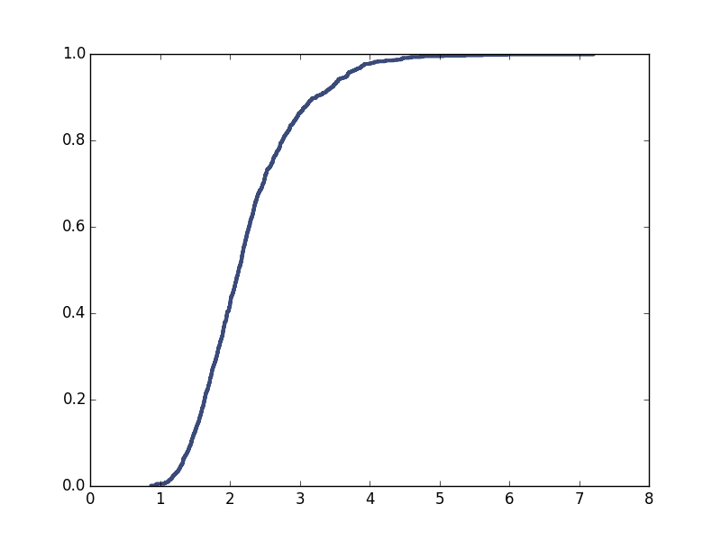
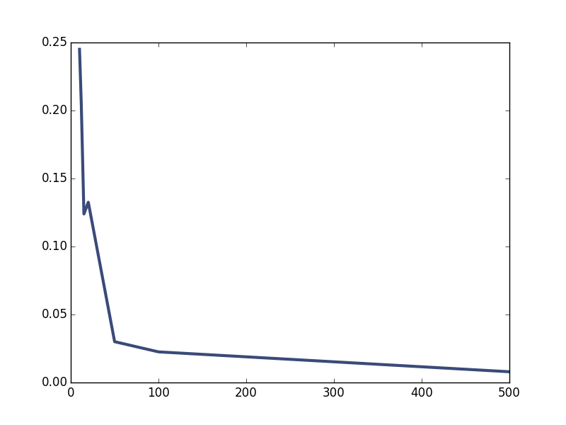

[Think Stats Chapter 8 Exercise 2](http://greenteapress.com/thinkstats2/html/thinkstats2009.html#toc77) (scoring)

>> The plot of the cdf of the estimations is here
>> 
>> and here we get the 
>> Standard Error
>> ```
>> est = [e-2 for e in means]
>> np.mean(est)
>> 0.2446
>> ```
>> and the 
>> 90% confidence interval
>> ```
>> cdf.Percentile(5)
>> cdf.Percentile(95)
>> [1.31,3.68]
>> and to see the relationship of the sample size to the standard error we can graph sample sizes [10, 12, 15, 20, 50, 100, 500]
>> 

